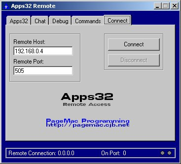



## Apps32 Remote: Tech Support System

### Description

Okay, you all are computer geniuses... you all know it comes with that responsibility? You know, the one where you hav to help everyone you know that has a computer problem? Like, "Hey! I was trying to plug in my monitor, but it wouldn't fit with all those little metal points, so I cut them all off, and now it doesn't work! Help me!". Okay, say you have someone a long ways away, or you're at work and can't help. Apps32 can help! This remote tool can connect to the other user, get screenshots, reboot, and do a complete control... thats right! Get constantly updating screenshots, and type, and use the mouse! It's easy to do tech support with Apps32! Please leave comments!
 
### More Info
 

             |
---                |---
**Submitted On**   |2001-12-28 14:17:02
**By**             |[Daniel Smith \(SqueakMac\)](https://github.com/Planet-Source-Code/PSCIndex/blob/master/ByAuthor/daniel-smith-squeakmac.md)
**Level**          |Intermediate
**User Rating**    |4.7 (99 globes from 21 users)
**Compatibility**  |VB 5\.0, VB 6\.0
**Category**       |[Internet/ HTML](https://github.com/Planet-Source-Code/PSCIndex/blob/master/ByCategory/internet-html__1-34.md)
**World**          |[Visual Basic](https://github.com/Planet-Source-Code/PSCIndex/blob/master/ByWorld/visual-basic.md)
**Archive File**   |[Apps32\_Rem4445412282001\.zip](https://github.com/Planet-Source-Code/daniel-smith-squeakmac-apps32-remote-tech-support-system__1-30182/archive/master.zip)

